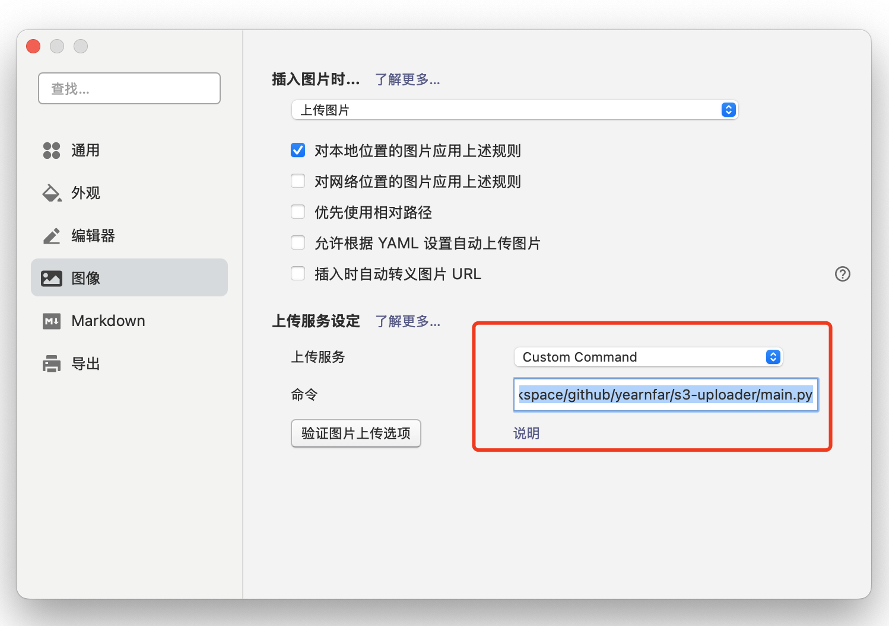

# typora-s3-uploader

typora-s3-uploader支持在Typora工具中上传图片资源到AWS S3




### Feature
- 上传到AWS s3
- 支持上传后根据定义模版修改文件名
- 支持png、jpg文件转webp

### Install

```shell
pip install -r requirement.txt
```

### Usage

默认加载main.py所在目录的config.json配置，也可以通过 --config 指定配置文件:

```shell
python main.py file1.txt file2.txt

python main.py --config CONFIG_DIR/config.json file1.txt file2.txt
```

### config.json

```json
{
  "image_to_webp": true,
  "base_url": "https://www.example.com",
  "bucket_name": "my-bucket",
  "object_key": "{year}/{month}/{file_md5}.{ext}",
  "aws_access_key_id": "",
  "aws_secret_access_key": "",
  "aws_region": ""
}

```

object_key 支持下列可替换字符:
- filename": 文件名称，含后缀
- name": 文件名称，不含后缀
- ext": 文件后缀，不含.，例如: png
- timestamp": 时间戳
- full_year": 年，例如：2025
- full_month": 月，01~12
- full_day": 天，01~31
- year": 年，2位数，例如：25
- month":月，1~12，不含0
- day": 天，不含1~31，不包含0
- datetime_second": 年月日时分秒，例如：20250410125959
- file_md5: 文件的md5值